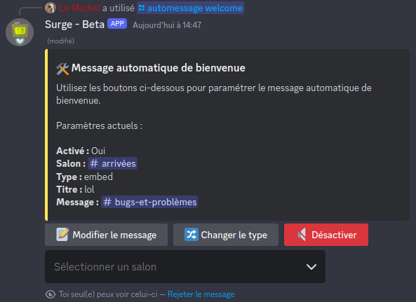

# Messages automatiques

Surge possède un module permettant de gérer des messages de bienvenue et de départ des membres.

Pour gérer ces messages, il faut utiliser la commande `/automessage` qui comporte deux sous-commandes :

- `/automessage welcome` : pour gérer les messages de bienvenue
- `/automessage leave` : pour gérer les messages de départ

Les deux commandes se comportent exactement de la même manière, elles configurent chacune leur type de message automatique associé.

# Configuration

Lorsque la commande `/automessage welcome` ou `/automessage leave` est exécutée, le message suivant apparait :

?> Si le message automatique n'est pas activé, il n'y aura qu'un bouton `🔊 Activer` et les paramètres ne seront pas affichés.

- `📝 Modifier le message` : modifier le titre et le contenu du message
- `🔀 Changer le type` : changer le type du message, soit un message normal soit un embed
- `🔇 Désactiver` : désactiver le message automatique
- `Sélectionner un salon` : choisir dans quel salon le message automatique est envoyé