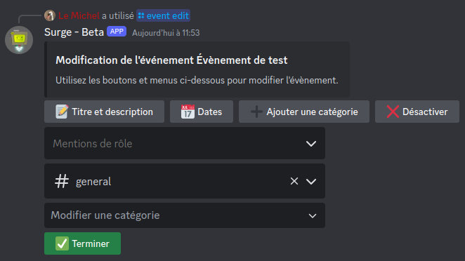
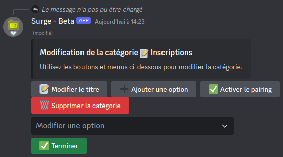
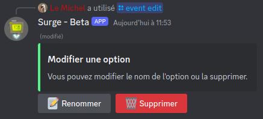

# Gestion des évènements

La commande `/event` réunis toutes les sous-commandes utiles pour gérer un évènement :

- [`/event create`](#création-d39un-évènement) : créer un évènement dans le salon du la commande
- [`/event edit`](#modification-d39un-évènement) : modifier un évènement existant 
- [`/event reset`](#réinitialisation-des-inscriptions) : réinitialiser les inscriptions d'un évènement
- [`/event list`](#lister-les-évènements-du-serveur) : lister tous les évènements du serveur
- [`/event on|off`](#activer-ou-désactiver-un-évènement) : activer ou désactiver un évènement
- [`/event delete`](#suppression-d39un-évènement) : supprimer un évènement

# Création d'un évènement

Pour créer un évènement, il faut exécuter la commande `/event create`. Le salon où la commande est exécutée sera celui où le message de l'évènement sera envoyé lorsque l'évènement sera prêt.

Si vous souhaitez créer un tout nouvel évènenement, spécifiez `type:new`. Si vous souhaitez continuer la création d'un évènement existant mais non terminé, sélectionnez `type:continue`.

?> Il est tout à fait possible de modifier le salon d'un évènement plus tard avec la commande `/event edit`.

Le processus de création de l'évènement démarre, et le bot vous demandera plusieurs informations :

- Le titre de l'évènement et sa description (optionnelle)
- Les paires de dates auxquelles l'évènement commence et est réinitialisé
- Les possibles mentions de rôles lors du début de l'évènement
- Les catégories :
    - Le nom de la catégorie
    - Les options d'inscription de cette catégorie
    - La configuration du système de groupe, si nécessaire
    - Le nombre maximum d'options dans lesquelles les membres peuvent s'inscrire pour cette catégorie

!> Si le système de groupe est activé pour une catégorie, alors le nombre maximum d'option dans lesquelles les membres peuvent s'inscrire est automatiquement `1`, et n'est pas modifiable.

Vous pouvez à tout moment faire un pause dans la création de l'évènement en supprimant le message de Surge ou en ignorant un formulaire. Vous pourrez reprendre la création plus tard avec la commande `/event create type:continue`.

Lorsque la création de l'évènement est terminée, le message est envoyé dans le salon actuel et les membres peuvent commencer à s'inscrire.

# Modification d'un évènement

Pour modifier un évènement, il faut exécuter la commande `/event edit`. Cela ouvrira un menu pour choisir l'évènement que l'on souhaite modifier.

Une fois l'évènement choisi, un message est envoyé avec plusieurs boutons et menus :

- `📝 Titre et description` : modifier le titre et la description de l'évènement
- `📅 Dates` : ajouter ou supprimer des dates à l'évènement
- `➕ Ajouter une catégorie` : ajouter une catégorie à l'évènement
- `❌ Désactiver` : désactiver l'évènement
- `Mentions de rôle` : ajouter ou supprimer des mentions de rôle lorsque l'évènement commence
- `# general` : salon actuel de l'évènement, modifiable en en sélectionnant un autre
- [`Modifier une catégorie`](#modification-d39une-catégorie) : afficher le message de modification de la catégorie sélectionnée
- `✅ Terminer` : appliquer les modifications effectuées

!> Si vous supprimer le message de modification de l'évènement sans cliquer sur `✅ Terminer`, les modifications ne seront appliquées que la prochaine fois que quelqu'un interagi avec l'évènement (inscription ou mise à jour d'un groupe).

## Modification d'une catégorie

Lorsque vous sélectionnez une catégorie à modifier, le message suivant apparait :

- `📝 Modifier le titre` : modifier le titre de la catégorie
- `➕ Ajouter une option` : ajouter une option à la catégorie
- `✅ Activer le pairing` ou `❌ Désactiver le pairing` : activer ou désactiver le système de groupe
- `🗑️ Supprimer la catégorie` : supprimer la catégorie de l'évènement
- [`Modifier une option`](#modification-d39une-option) : afficher le message de modification de l'option choisie
- `✅ Terminer` : revenir sur la modification de l'évènement

?> Si l'évènement ne possède qu'une seule catégorie, il n'est pas possible de la supprimer.

Si le système de groupe est activé pour cette catégorie, un cinquième bouton est visible : `🛠️ Configurer le système de groupe`. Il permet de changer les paramètres du système de groupe.

## Modification d'une option

Lorsque vous sélectionnez une option à modifier, le message suivant apparait :

- `📝 Renommer` : modifier le titre de l'option
- `🗑️ Supprimer` : supprimer l'option

?> Si la catégorie ne possède qu'une seule option, il n'est pas possible de supprimer cette option.

# Réinitialisation des inscriptions

La commande `/event reset` permet de réinitialiser les inscriptions d'un évènement. Cela supprimera toute inscription effectuée par les membres, et supprimera aussi les éventuels groupes.

> Cela a le même effet que lorsque l'évènement atteint une date de réinitialisation.

# Lister les évènements du serveur

La commande `/event list` permet d'afficher tous les évènements d'un serveur. Les évènements sont triés en deux catégories : les évènements prêts et les évènements en cours de création.

Chaque évènement est précédé d'un émoji ❌ ou ✅ pour indiquer si il est activé ou non, et est suivi du salon dans lequel il est.

# Activer ou désactiver un évènement

Les commandes `/event on` et `/event off` permettent d'activer ou de désactiver un des évènements du serveur. Lorsqu'un évènement est désactivé, le message de l'évènement est supprimé.

> Un salon ne peut toujours contenir qu'un seul évènement, même si celui-ci est désactivé.

Lorsqu'un évènement est réactivé, sa date est mise à jour, mais les inscriptions sont les mêmes qu'au moment de la désactivation.   

# Suppression d'un évènement

La commande `/event delete` permet de supprimer un évènement. Cela ouvrira un menu pour choisir l'évènement que l'on souhaite supprimer.