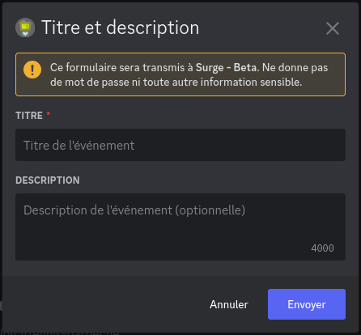
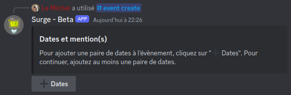
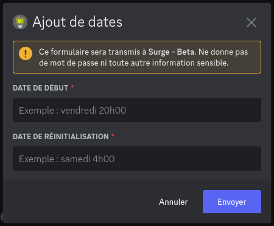
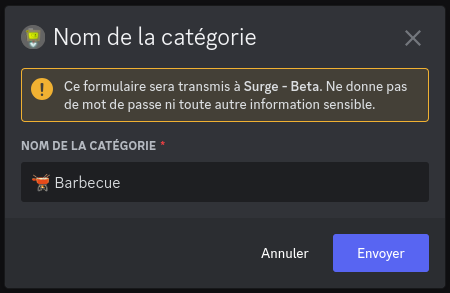
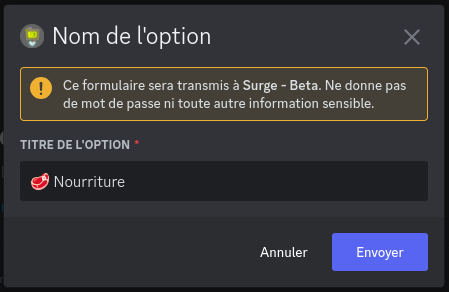
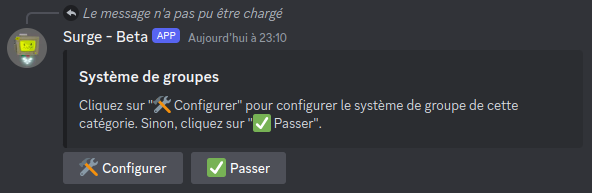

# Création d'un évènement

Imaginons un club de tennis qui organise un entrainement le samedi soir avec un barbecue ensuite. Nous allons voir dans ce guide comment créer un évènement avec Surge pour gérer cela au mieux.

# Définition des besoins

## Dates

L'évènement à lieu le samedi soir, il commence vers 17h, et se termine vers 23h30. Ces deux dates correspondent respectivement à la date de début de l'évènement, et à la date de fin, dont nous parlerons le plus souvent sous le nom de "date de réinitialisation".

## Catégories

Pour cet évènement, l'organisateur souhaite savoir plusieurs choses à propos des membres :
- Est-ce qu'ils peuvent venir ?
- Est-ce qu'ils veulent jouer ?
- Est-ce qu'ils veulent faire des matchs en double ?
- Est-ce qu'ils peuvent amener de la nourriture pour le barbecue ?
- Est-ce qu'ils peuvent amener des boissons ?

On peut voir que ces questions se répartissent en deux catégories : la présence des membres, ainsi que leur participation pour le barbecue.

On peut déduire de cela qu'il faudra deux catégories distinctes sur l'évènement. Nommons-les "📝 Inscriptions" et "🫕 Barbecue".

# Création de l'évènement

Maintenant que l'on sait plus précisement comment s'organise l'évènement, on peut passer à sa création sur Discord.

## Titre

Pour créer un évènement, il faut se rendre dans le salon où l'on désire que l'évènement soit, puis faire la commande `/event create`.

Cela affichera le formulaire suivant :

Il faut rentrer ici le titre ainsi que la description de l'évènement. Cette dernière est optionnelle, mais vous pouvez dire ce que vous voulez dedans pour préciser des informations sur le lieu de rendez-vous par exemple.

Quand vous avez fini, cliquez sur envoyer.

!> Si vous cliquez en dehors d'un formulaire durant la création de l'évènement et que celui-ci disparait, faite simplement la commande `/event create type:continue` pour reprendre la création sans avoir besoin de tout recommencer.

## Dates

La prochaine étape est l'ajout des dates de l'évènement. Comme définit plus haut, notre évènement ne se déroule qu'une seule fois par semaine : on a donc besoin que d'une seule paire de dates.

> Une paire de dates correspond à un déroulement de l'évènement.

!> La récurrence des évènements ne fonctionne que sur une semaine. Un évènement ne peux pas se dérouler qu'une semaine sur deux.

Cliquez sur "➕ Dates" pour ajouter la première paire de dates.

Un nouveau formulaire apparait :

Dans notre cas, la date de départ est `17h00` et la date de réinitialisation est `23h30`.

> Les dates doivent bien respecter le format `jour heures:minutes`. Le séparateur des heures et des minutes peut être `h` ou `:`.

Lorsque les dates ont été ajouté après avoir cliqué sur "Envoyer", on peut en ajouter d'autres en cliquant sur "➕ Dates". Dans notre cas, on a besoin que d'une seule paire de dates, donc on peut faire "✅ Suivant".

## Mentions

On peut ensuite configurer les rôles à mentionner lors du début de l'évènement. Cela peut être utile pour prévenir certaines personnes.

On peut sélectionner des rôles avec le menu, ou cliquer sur "✅ Passer" si l'on ne souhaite pas mentionner de rôle.

## Catégories

Un nouveau formulaire apparaît, il faut entrer le nom d'une catégorie. On a défini deux catégories avant de commencer, "📝 Incriptions" et "🫕 Barbecue". Commençons par "🫕 Barbecue".

### Options de catégorie

Les options de catégorie sont là où les membres vont pouvoir s'inscrire.

On va définir plusieurs options pour répondre à nos besoins pour la catégorie "🫕 Barbecue" :

- 🥩 Nourriture : pour les membres qui peuvent apporter à manger.
- 🍻 Boisson : pour les membres qui peuvent apporter à boire.

On clique sur "➕ Option" pour ajouter la première option :

Après avoir cliqué sur "Envoyer", on peut refaire la même chose pour la deuxième option, "🍻 Boisson".

> Il est recommandé d'inclure un emoji dans le nom des options. Attention cependant : il ne peut être présent qu'au début du nom de l'option.

Lorsque les toutes les options ont été ajoutées, on clique sur "✅ Suivant".

Le bot demande si on veut configurer le système de groupe, mais ce n'est pas utile pour cette catégorie : les membres n'ont pas besoin de faire des groupes pour amener à manger.

### Nombre maximum d'options

On clique donc sur "✅ Passer" pour configurer le nombre maximum d'options dans lequel les membres peuvent s'inscrire dans cette catégorie.

On ne veut pas empêcher les membres d'apporter et de la nourriture et des boissons, on selectionne donc l'option `2` dans le menu.

On peut maintenant passer à la deuxième catégorie : "📝 Incriptions".

Les options nécessaires pour cette catégorie sont les suivantes :
- ✅ Dispo : les membres peuvent venir à l'évènement mais ne veulent pas faire de match
- 🔰 Match - Moyen : les membres qui veulent faire des matchs et qui ont un niveau moyen
- 🎾 Match - Avancé : les membres qui veulent faire des matchs et qui ont un très bon niveau

On crée les options, puis le bot demande pour le système de groupe :

On clique sur "🛠️ Configurer", car on a besoin que les membres puissent se défier.

Quatre menus sont alors disponibles pour définir le fonctionnement du système de groupe :
- Même option : les membres peuvent être dans un même groupe uniquement si ils sont inscrits dans la même option
- Options d'origine : dans quelles options doivent être inscrits les membres pour avoir accès aux groupes
- Nombre minimum de membres par groupe : nombre minimum de membres requis pour former un groupe
- Nombre maximum de membres par groupe : nombre maximum de membres autorisés dans un groupe

Dans notre cas, on va mettre "Même option" sur "Non" car on veut autoriser les membres avec un niveau moyen de défier ceux avec un niveau fort, et vice-versa.

"Options d'origine" sera sur tout sauf "✅ Dispo", car les membres qui veulent seulement venir sans faire de matchs ne doivent pas faire de groupes.

Le nombre minimum sera `2` et le maximum sera `4`, pour autoriser des matchs simples ou des doubles.

> Notez qu'il n'est pas possible d'interdire les groupes de 3.

Une fois cette configuration terminée, il n'y a plus qu'à cliquer sur "✅ Suivant" plusieurs fois pour terminer la création de l'évènement.

Le message de l'évènement est alors envoyé dans le salon, avec des menus pour permettre aux membres de s'inscrire, de former des groupes si le système de groupe est activé, ou de se désinscrire.

